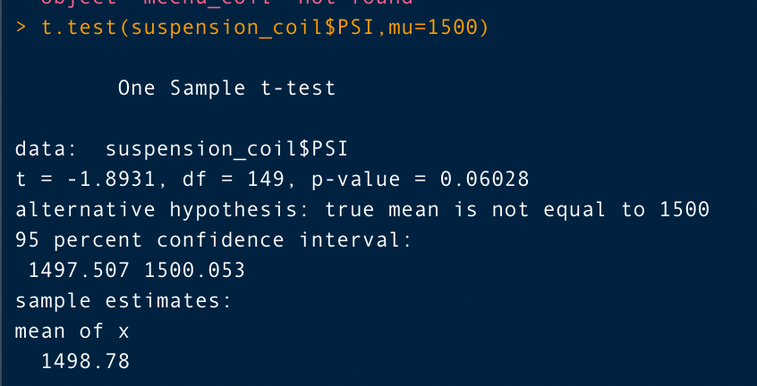

# MechaCar_Statistical_Analysis
R, RStudio

## Overview
AutosRUs has called for an analysis on its newest prototype, the MechaCar, has been interrupted by production troubles and it is blocking the manufacturing teams progress. Upper management has called on a review of the production data for insights that may assist the manufacturing team. This analysis is broken into 4 parts. 

- Deliverable 1: Perform multiple linear regression analysis to identify which variables in the dataset predict the mpg of MechaCar prototypes

- Deliverable 2: Collect summary statistics on the pounds per square inch (PSI) of the suspension coils from the manufacturing lots

- Deliverable 3: Run t-tests to determine if the manufacturing lots are statistically different from the mean population

- Deliverable 4: Design a statistical study to compare vehicle performance of the MechaCar vehicles against vehicles from other manufacturers

## Results

### Linear Regression to Predict MPG
The MechaCar_mpg.csv provides mpg test results for 50 prototype MechaCars. These prototypes are produced using multiple design specifications to target ideal vehicle performance. The metrics we will use to predict mpg for future prototypes include vehicle length, vehicle weight, spoiler angle, drivetrain (AWD), and ground clearnace. These values will act as independent variables in our multiple linear regression.  

After running the linear model, our y-intercept is (-104), and our slope (coefficients) for the multiple linear regression equation are listed beneath thier corrisponding variable. Our line for predicting future mpg test results is:

**mpg = -104 + 6.27vehicle_length + .001vehicle_weight + .07spoiler_angle + 3.55ground_clearance + (-3.41)AWD**

The next step is to determine how effective the regression model approximates real-world data points. Using the summary() function, we can generate statistics including the r-squared value and the p-value. The r-squared value will usually range from 0-1 and represents the probability of future data points fitting into the linear model. The p-value is used in hypothesis testing and gives evidence against the null hypothesis. In this analysis the null hypothesis is that the slope of the line is equal to 0. The alternative hypothesis is that the slope of the line is not equal to 0. For this analysis our level of significance is <.05. This means that if our p-value is less than .05, we will have stronger evidence to reject the null hypothesis and conclude that the effect of the linear model is statistically significant in calculating future mpg prototypes.  

After running the summary() function on our multiple linear regression we see that our r-squared value is 0.7149. This value means that roughly 72% of all mpg predicitons will be correct when using this linear model. The p-value of our linear regression is 5.35e-11, which is drastically smaller than our initial level of significance (.05). With this p-value, there is sufficient evidence to reject the null hypothesis and conclude that the linear model has a slope that is not equal to zero and that there is an effect when using this linear model on future mpg protottypes. 

### Summary Statistics on Suspension Coils
The MechaCar Suspension_Coil.csv contains the weight capacities of multiple suspension coils that were tested to determine whether the consistency of the manufacturing process across different production lots. In this Deliverable we will summary statistic tables to the suspension coil's PSI across all lots and to display the PSI metrics (mean, median, variance, and standard deviation). According to the design specifications for the MechaCar suspension coils, the vairance must not exceed 100 pounds per square inch. 

After analyzing the manufacturing lots in total using the summarize() function, we see that the total variance of manufacturing lots is 62.294 PSI. This number does not excceed the design specifications standards for the MechaCar suspension coils. 

In order to measure the PSI variance of each lot indivdually, we use the group_by() function on the Manufacturing_Lot variable to seperate each lot and find the corresponding PSI variances. The variance of each lot is listed below:

- Lot 1 has a variance of 0.980 PSI 

- Lot 2 has a variance of 7.470 PSI 

- Lot 3 has a variance of 170.286 PSI

Lot 1 and Lot 2 each have a variance that is within the specifications previously mentioned in the MechaCar specifications. However, Lot 3 has a variance that exceeds 100 PSI. The current manufacturing data on Lot 3 does not meet the design specifications for manufacturing lots due to its excessive PSI variance of 170.286 PSI. Lot 1 and Lot 2 meet the design specifications, as does the total lot variance. 

### T-Test on Suspension Coils
In order to determine how reliable the sample data from Suspension_Coil.csv, we will use a t.test() function to find and compare the p-value of the sample of total lots and each individual lot against the total population of MechaCar data. T-test's are used to find any statistical difference between the mean of a sample dataset and a hypothesized population mean. In this analysis our population mean is 1500. First we will run a t-test on the mean all of our lots versus the population mean. Our null hypothesis is there is no statistical differecne between the observed sample mean (all lots) and its presumed population mean (mu = 1500). Our alternate hypothesis is there is a statistical difference between the observed sample mean and its presumed population mean. 

#### All Lots

According to the image above, our p-value for all lots and the population mean is 0.060. This number exceeds our 0.05 level of significance, therefore we do not have enough evidence to reject the null hypothesis and the total lot mean is similar to the population mean. 

#### Lot 1

The p-value resulting from this t-test is 1.000. We cannot reject the null and the PSI for Manufacturing Lot 1 is similar to the PSI of the population mean. 

#### Lot 2

The p-value acquired in the Lot 2 t-test is 0.607. This is greater than our level of significance (0.05), therefore we cannot reject the null and we can state there is a level of similarity between the PSI mean from Lot 2 MechaCars and the PSI population mean. 

#### Lot 3

The final p-value in the Lot 3 t-test is 0.042. This is less than our level of significance and we must reject our null hypothesis. The mean PSI from Lot 3 is not similar to the mean PSI of the population of 1500. 

## Analysis

### Study Design: MechaCar vs Competition
In this statistical study we want to quantify how MechaCars perform against other car manufacturing companies, we can use a linear model to predict the cost of vehicles and potentially adjust MechaCar prices to outsell the competition. In order to perform a Multiple Linear Regression we need one dependent variable (cost), and multiple independent variable. 

#### Metrics

**Dependent Variable: Cost($)**

**Independent Variables: Production Cost($), MPG, Horse Power**

#### Hypothesis Testing
Null Hypothesis: Production cost and car performance has no effect on the cost of a vehicle.
Alternate Hypothesis: Production cost and car performance has an effect on the cost of a vehicle.

#### Multiple Linear Regression
Using a linear model we can predict a continuous, dependent variable (cost($)), based on our three independent variables (production cost($), MPG, and Horse Power). We aim to calculate the slope and y-intercept values to minimize the distance between each data point from the linear model. Once we have a linear model calculated we can use it to determine the effects our independent variables have on our prices. 

#### Data Needed
The data required to perform this analysis includes the prices, the procuction costs, the miles per gallon, and the horsepower of our vehicles and our competitors vehicles. We can use the MechaCar data to form an equation and then repeat the Multiple Linear Regression with a dataset from a competitor. By comparing linear models we can investigate prices on similar types of vehicles and whether or not we can alter our prices based on our independent variables in order to gain an advantage with customers over our competitors.  
